# 첫 버전 검증 결과

검증일: 2026-10-02

## 2026-10-06 — 보고서 형식 선택과 다운로드 동작 분리

화살표 메뉴는 형식만 선택하도록 수정했다. Markdown을 선택하면 기본 버튼이 ‘Markdown 내려받기’로 바뀌고, 버튼을 눌렀을 때만 `.md` 파일을 내려받는다. TXT로 바꾸면 ‘TXT 내려받기’가 된다. 선택된 형식을 메뉴에 표시하고, 선택 후 다운로드 버튼으로 키보드 초점을 옮긴다. 대상 0건이면 형식은 선택할 수 있지만 다운로드 버튼은 비활성화한다.

- 파일 내용과 검토 규칙은 변경하지 않았다.
- 로컬 서버·단일 HTML에서 **각각 23개 UI 검증 묶음 통과**, JavaScript·콘솔 오류 0건.
- 다운로드 이벤트를 감시하여 TXT·Markdown 메뉴 선택만으로 파일이 내려받아지지 않음을 확인했다. 이어서 기본 버튼을 눌러 `.txt`·`.md` 파일명과 내용·한글·확인 불가 메모를 확인했다.
- 체크한 2건의 범위는 형식 변경 후에도 유지되고, 빈 결과·키보드·320px·390px 화면 검증도 통과했다.
- 로컬에 반영하며 공개 사이트 배포는 사용자 요청 시 모아서 진행한다.

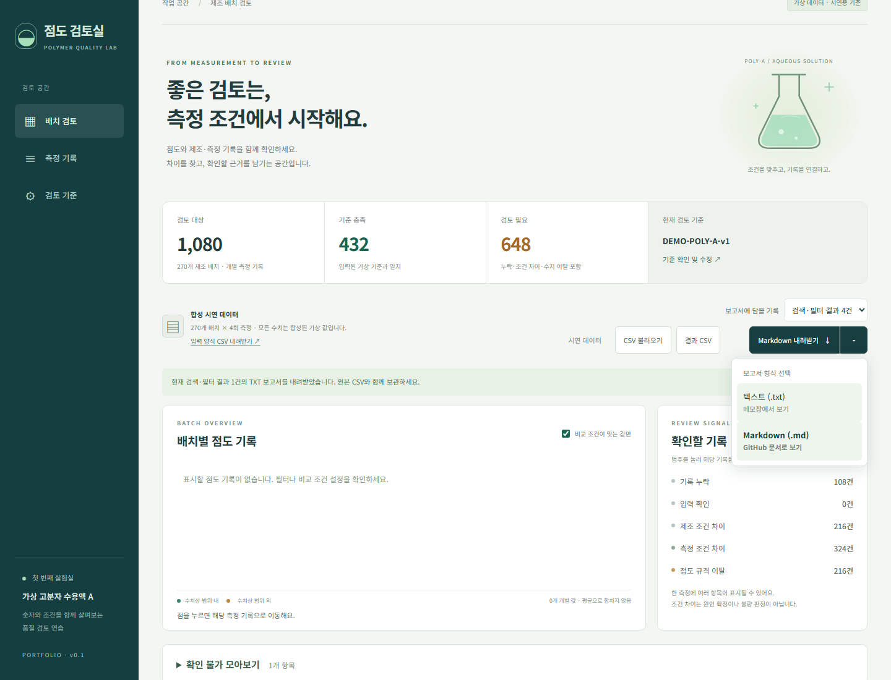

## 2026-10-06 — TXT 보고서와 체크한 기록 내보내기

상단에 TXT 내려받기와 형식 선택 화살표를 추가했다. TXT는 메모장에서 읽기 쉽도록 한글 항목·문장으로 구성하고 UTF-8 BOM·CRLF를 사용한다. 기존 Markdown 보고서는 화살표 메뉴로 제공한다. PDF와 그래프 다운로드는 후속 확장 대상으로 남긴다.

측정 기록 앞 체크박스와 현재 페이지 전체 선택, 선택 해제를 추가했다. 첫 선택 시 보고서 범위가 체크한 기록으로 바뀐다. 검색·필터·페이지가 달라도 선택한 측정 ID를 유지하며, 선택된 기록을 원본 순서대로 담는다. 대상 0건은 내려받을 수 없고, 데이터를 불러오거나 새로고침하면 선택을 초기화한다. 자료 확인 체크 상태·메모의 자동 저장은 기존과 같다.

- 코어 테스트 **21개 통과 / 실패 0건**. TXT의 기준·단위·0 값·빈 메모·여러 줄·확인 불가 이유와 분류, 변경된 기준에서 이전 상태 무효화를 확인했다.
- 로컬 서버와 단일 HTML에서 **각각 22개 UI 검증 묶음 통과**, JavaScript·콘솔 오류 0건.
- 실제 TXT 파일의 확장자·BOM·CRLF·1건 필터, 선택한 2건의 TXT와 Markdown에 각 메모·범위가 포함되고 다른 기록은 제외됨을 확인했다.
- 선택을 유지한 채 검색 결과가 없어도 보고서를 내보내고, 현재 페이지 전체 선택·부분 선택 표시·해제·빈 선택·시연 데이터 재로딩 초기화를 검증했다.
- 키보드 Enter·Space·Escape, 메뉴 바깥 클릭, 320px·390px의 메뉴 위치와 44px 버튼을 검증하고 화면을 직접 확인했다.
- 로컬에 반영하며 공개 사이트 배포는 사용자 요청 시 모아서 진행한다.

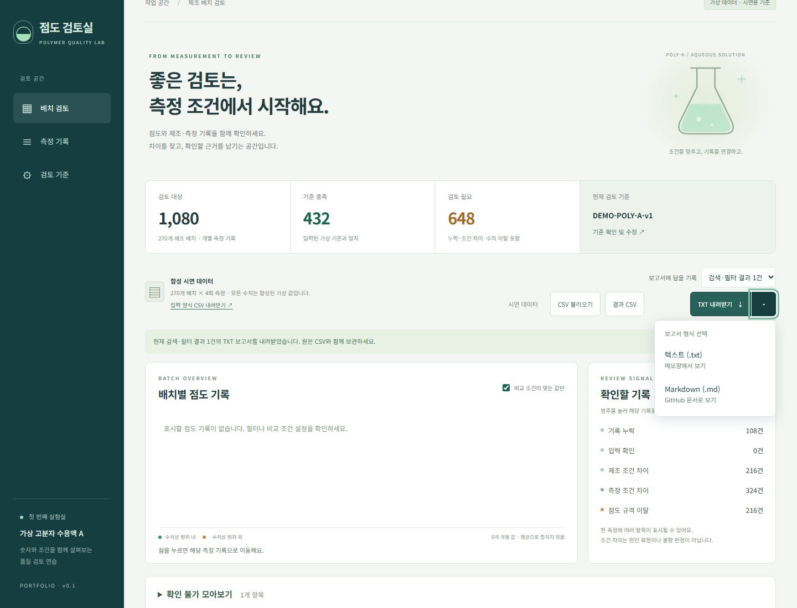

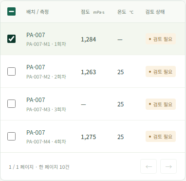

## 2026-10-06 — 고정 보고서 버튼 제거와 자동 저장 안내

확인 불가 메모·분류·체크가 입력 즉시 브라우저에 저장된다는 점을 확인한 사용자가 고정 보고서 버튼 제거를 요청했다. 화면 아래 버튼과 스크롤 이벤트, 전용 여백을 제거하고 상단 보고서 다운로드만 제공한다. 확인 불가 메모 입력칸에는 분류와 메모가 자동 저장된다는 안내를 추가했다.

- 코어 검토·저장 규칙은 변경하지 않았다.
- Chromium 서버·단일 HTML 버전 **각각 20개 검증 묶음 통과**, JavaScript·콘솔 오류 0건.
- 기존 새로고침 후 확인 불가 메모·분류 복원, 상단 보고서 다운로드, 기준 변경과 320px·390px 화면 검증을 통과했다.
- 로컬에서 수정·확인했으며 공개 사이트 배포는 사용자 요청 시 모아서 진행한다.

아래 고정 버튼 추가 기록은 이전 구현의 검증 이력이다. 현재 화면에는 고정 보고서 버튼이 없다.

## 2026-10-06 — 스크롤을 따라오는 보고서 저장 버튼

위쪽 보고서 버튼을 지나 내려오면 화면 아래에 고정 저장 버튼을 표시한다. 현재 검색·필터 건수와 `.md` 다운로드 안내를 함께 보여준다. 위로 돌아오면 숨기며, 검색 결과가 없으면 위·아래 버튼을 모두 비활성화한다. 두 버튼은 같은 저장 함수를 사용한다. 페이지 끝에 여백을 두어 마지막 메모 입력칸이 고정 버튼에 가려지지 않게 했다.

- 코어 테스트 **19 passed / 0 failed**.
- Chromium 서버·단일 HTML 버전 **각각 21개 검증 묶음 통과**, JavaScript·콘솔 오류 0건.
- 고정 버튼의 표시·숨김·범위 4건, 실제 다운로드에 메모와 체크 상태 포함, 검색 결과가 없는 경우 비활성화를 검증했다.
- 320px·390px에서 버튼 위치·가로 넘침·44px 이상 버튼 높이·페이지 끝 메모가 가려지지 않음을 확인하고 화면을 직접 검토했다.
- 사용자 요청에 따라 이번 수정은 로컬에서 확인하며 공개 사이트 배포는 나중에 모아서 진행한다.

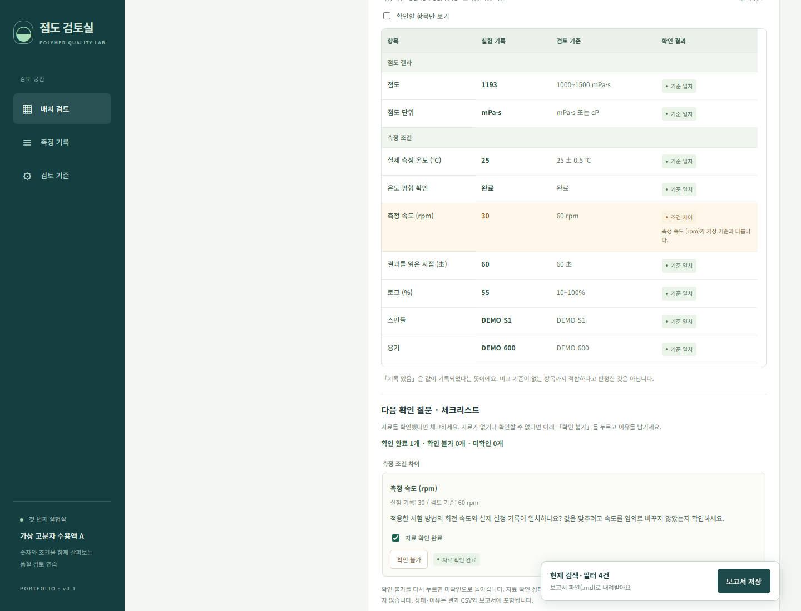

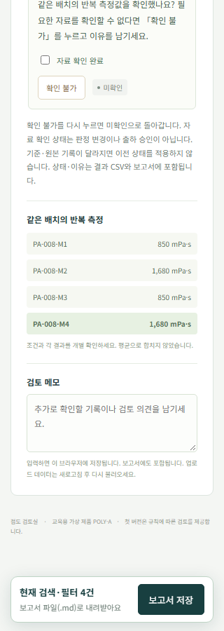

## 2026-10-06 — 기록·기준 비교표 접기와 펼치기

**실험 기록 ↔ 검토 기준**을 기본적으로 접힌 비교표로 바꿨다. 제목 전체를 눌러 접거나 펼칠 수 있고, 아래 체크리스트는 비교표가 접혀 있어도 표시한다. 다른 측정 기록을 선택하거나 상세 화면을 다시 그릴 때 현재 펼침 상태를 유지한다. 새로고침하면 접힌 상태로 시작한다.

- 코어 테스트 **19 passed / 0 failed**.
- Chromium 서버·단일 HTML 버전 **각각 20개 검증 묶음 통과**, JavaScript·콘솔 오류 0건.
- 기본 접힘, 제목 클릭·Enter·Space로 전환, 40항목 표시·확인 항목 필터, 측정 선택 후 펼침 상태 유지, 접힌 상태의 아래 체크리스트 표시를 검증했다.
- 320px·390px에서 접기·펼치기와 그래프 이동을 확인하고 접힌 화면을 직접 검토했다.

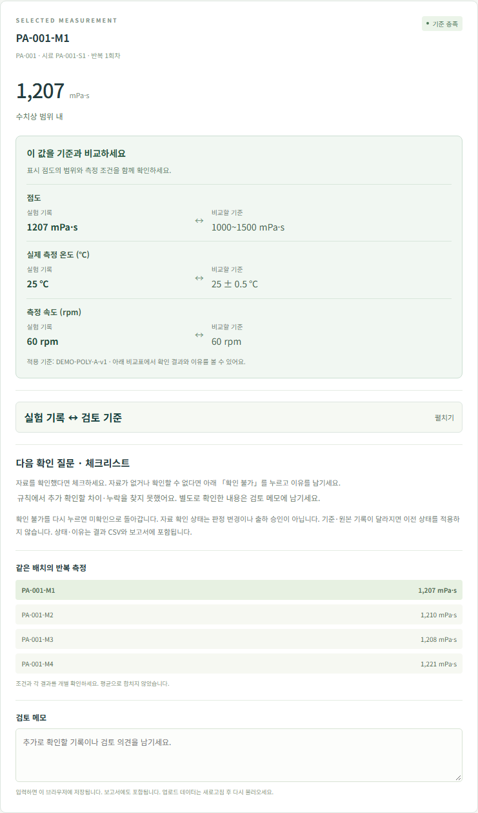

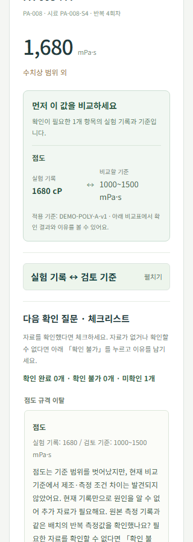

## 2026-10-06 — 그래프에서 측정 기록으로 이동

배치별 점도 그래프의 점을 누르면 그 점의 고유 측정 번호를 선택하고 상세 기록으로 이동한다. 표의 페이지와 선택 행도 함께 바뀌며, 검색·검토 상태·확인 항목 필터는 유지한다. 선택한 점은 테두리로 표시하고, 키보드 Enter·Space로도 상세 기록을 열 수 있다.

- 코어 테스트 **19 passed / 0 failed**.
- Chromium 서버·단일 HTML 버전 **각각 19개 검증 묶음 통과**, JavaScript·콘솔 오류 0건.
- PA-008의 각 반복값을 구분해 클릭·키보드로 선택하고, 4번째 페이지의 선택 행과 상세 측정 번호가 일치함을 확인했다.
- 검색·상태·항목 필터 유지, 선택 점 표시, 상세 기록으로 초점·화면 이동, 320px·390px의 점 클릭을 검증했다.

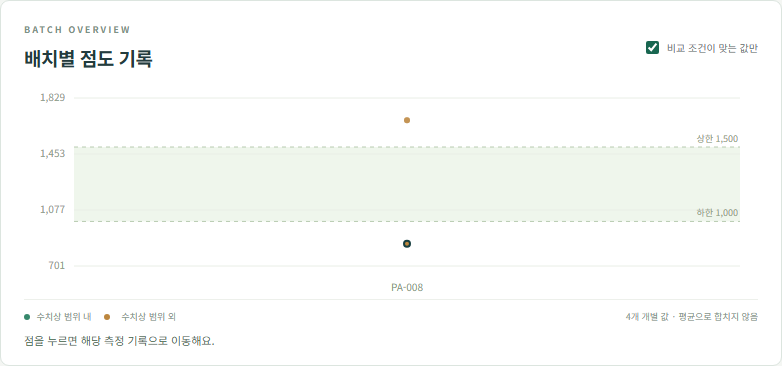

## 2026-10-06 — 확인 불가 이유 분류와 모아보기

기본 분류 5개와 사용자 분류 추가·삭제, 항목별 분류·메모 저장, 이유별 모아보기·페이지 이동·측정 기록 열기, 분류별 이유 CSV와 보고서를 구현했다. 기존 메모는 미분류로 읽으며, 분류 삭제 시 이 브라우저의 다른 데이터 파일을 포함해 메모 내용과 상태를 보존한다.

- 코어 테스트 **19 passed / 0 failed**. 분류 유효성·중복, 기존 메모 호환, 현재 기준에 유효한 확인 불가 항목만 집계, 분류 삭제와 입력 객체 보존, CSV 수식 보호·보고서 문자 처리를 검증했다.
- Chromium 서버·단일 HTML 버전 **각각 18개 검증 묶음 통과**, JavaScript·콘솔 오류 0건.
- 실제 UI에서 추가·삭제·선택·새로고침, 분류 삭제 후 미분류 이동과 메모 보존, 다른 파일의 저장 내용 보존, 모아보기 필터·21개 항목 페이지 이동·원본 기록 이동·CSV 다운로드를 검증했다.
- 320px·390px 가로 넘침 및 작은 화면의 분류 관리 창을 확인했다. 모아보기 스크린샷을 직접 검토했다.

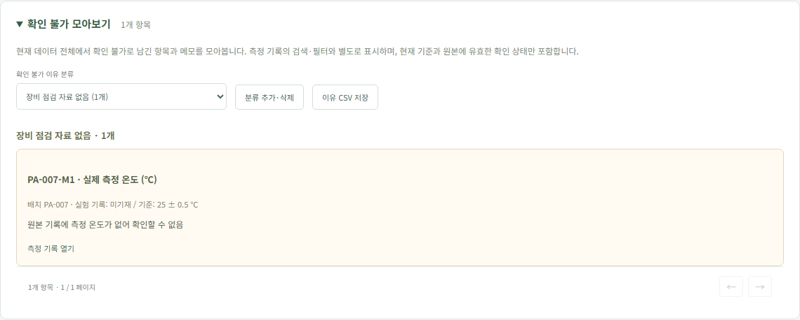

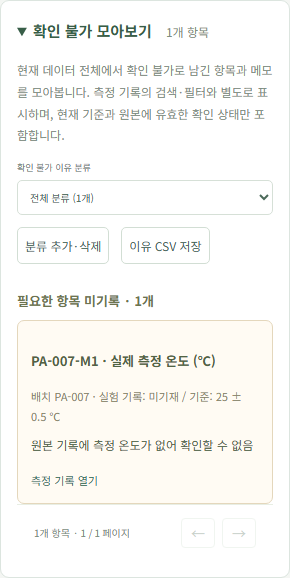

## 2026-10-06 — 점도만 이탈한 기록의 추가 자료 안내

PA-008처럼 현재 비교 기준에서 점도 이탈만 발견된 기록에 **제조·측정 조건 차이가 발견되지 않았고, 현재 기록만으로 원인을 알 수 없어 추가 자료가 필요하다**는 안내를 적용했다. 조건 차이·누락·입력 문제가 함께 있으면 이 안내를 적용하지 않는다. 자동으로 확인 완료나 확인 불가를 선택하지 않는다. 변경된 질문에 예전 완료 표시가 적용되지 않도록 해당 유형만 체크 규칙 버전을 구분했다.

- 코어 테스트 **16 passed / 0 failed**. 단독 점도 이탈과 조건 차이·누락·입력 문제의 구분, 이전 체크 제외, CSV·보고서 안내 포함을 검증했다.
- 테스트용 Chromium의 서버 버전·단일 HTML 파일 버전: **각각 15개 검증 묶음 통과**, JavaScript·콘솔 오류 0건.
- PA-008의 새 질문과 미확인 상태, 기존 저장·내보내기·기준 변경·CSV 업로드, 320px·390px 가로 넘침 검증을 통과했다.
- 새 안내의 화면을 직접 확인했다. 원본 가상 데이터와 수치 판정은 변경하지 않았다.

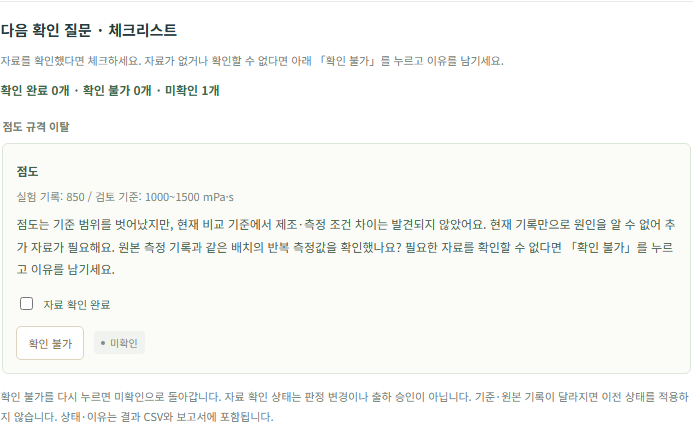

## 2026-10-05 — 확인 불가 상태와 항목별 이유

자료 확인 체크 아래에 **확인 불가** 버튼과 이유 입력칸을 추가했다. 상태는 미확인·자료 확인 완료·확인 불가로 구분하고, 확인 불가와 확인 완료가 동시에 표시되지 않도록 했다. 확인 불가를 다시 누르면 미확인으로 돌아간다. 상태와 이유는 기존 체크와 마찬가지로 원본 기록·기준·데이터별로 저장하고 CSV·보고서에도 포함한다. 이전 버전에서 저장한 체크는 확인 완료로 읽는다.

- `npm test`: **15 passed / 0 failed**. 기존 체크 호환, 완료·불가 구분, 이유 저장·내보내기와 문장 구분, 기준 변경 시 이전 상태 제외를 검증했다.
- 실제 Chrome 서버 버전 및 단일 HTML 파일 버전: **각각 14개 검증 묶음 통과**, JavaScript·콘솔 오류 0건.
- 체크 후 확인 불가 전환, 이유 작성, 새로고침 후 상태·이유 복원, 미확인·확인 완료로 전환, 원래 판정 유지, CSV·보고서 보존을 확인했다.
- 320px·390px 화면의 가로 넘침을 확인하고 작은 화면의 버튼·이유 입력칸 스크린샷을 직접 검토했다.

## 2026-10-05 — 온도 확인 질문을 쉬운 표현으로 수정

사용자가 ‘시험 방법의 목표 온도’와 ‘재측정 검토’의 의미를 이해하기 어렵다고 알려왔다. 질문에 실제 기록 온도와 현재 비교 기준을 직접 넣고, 원본 기록을 확인한 뒤 실제 온도가 달랐다면 다시 측정할 필요를 검토하도록 문장을 바꿨다. 수치 판정·체크 저장 방식은 유지했다.

`npm test` 14개, 실제 Chrome 서버·단일 HTML 파일 버전 각각 13개 검증 묶음이 통과했다. 작은 화면의 문장 표시를 스크린샷으로 직접 확인했다.

## 2026-10-05 — 추가 확인 질문과 체크리스트

사용자가 납득한 [네 가지 검토 원칙](검토_원칙.md)을 항목별 다음 질문과 자료 확인 체크리스트에 반영했습니다. 체크 완료는 가상 판정 변경이나 출하 승인을 뜻하지 않습니다.

- `npm test`: **14 passed / 0 failed**. 정상 기록의 빈 질문, 복합 사례의 항목·실제값·기준·순서, 입력 확인, 기준·원본·측정 변경 시 체크 분리, 보고서·CSV 보존을 검증했습니다.
- 실제 Chrome 서버 버전 및 단일 HTML 파일 버전: **각각 13개 검증 묶음 통과**, JavaScript·콘솔 오류 0건.
- 자료 확인 체크와 새로고침 후 복원, 체크 후 판정 유지, 기준 변경 시 이전 체크 미적용, 업로드 데이터와 기본 데이터의 분리, 누락 질문, CSV·보고서에 체크 상태 포함을 확인했습니다.
- 320px·390px 화면의 가로 넘침과 기능을 확인하고 체크리스트 스크린샷을 직접 검토했습니다.
- 합성 데이터·수치 기준·검토 판정 규칙은 변경하지 않았습니다.

## 2026-10-05 — 상단에서 비교할 값 안내

선택한 측정의 상단에 확인할 항목 이름과 실험 기록·비교 기준을 나란히 표시했습니다. 조건 차이·누락·입력 문제 등 확인할 값이 있으면 그 항목을 우선 안내합니다. 차이가 없는 기록은 점도·측정 온도·측정 속도를 안내합니다. 확인 항목이 많으면 처음 4개와 펼쳐 볼 수 있는 나머지 항목을 제공합니다.

- `npm test`: **12 passed / 0 failed**.
- 실제 Chrome 서버 버전 및 단일 HTML 파일 버전: **각각 12개 검증 묶음 통과**, JavaScript·콘솔 오류 0건.
- 실제 온도 28℃와 기준 25 ± 0.5℃, 실제 측정 속도 30 rpm과 기준 60 rpm, 기록 누락, 기준 수정 후 안내 갱신, 많은 누락 항목의 펼치기를 확인했습니다.
- 320px·390px 화면의 가로 넘침을 확인하고 데스크톱·작은 화면의 안내 스크린샷을 직접 검토했습니다.
- 데이터와 판정 규칙은 변경하지 않았습니다.

## 2026-10-05 — 실험 기록·검토 기준 비교표 개선

기존에는 다른 위치의 실험 기록과 기준을 번갈아 확인해야 했습니다. 새 비교표는 40개 항목의 기록·기준·확인 결과를 같은 행에 표시하고, 확인할 항목만 좁혀 볼 수 있습니다. 기준이 없는 항목은 `기록 있음`, 지원하지 않는 단위 등으로 점도를 비교할 수 없으면 `비교 불가`로 구분합니다. 데스크톱에서는 비교표에 더 넓은 공간을 배정하고 작은 화면에서는 기록과 기준을 나란히 둔 카드로 표시합니다.

- `npm test`: **12 passed / 0 failed**. 기존 11개에 전체 기록·변경 기준·누락·0 값·비교 불가·기록 전용 항목 표시 검증을 추가했습니다.
- 실제 Chrome 서버 버전 및 단일 HTML 파일 버전: **각각 11개 검증 묶음 통과**, JavaScript·콘솔 오류 0건.
- 정상·측정 조건 차이·기록 누락·점도 범위 이탈 사례, 확인 항목 필터, 기준 변경 후 비교표 갱신, CSV 문자 안전 표시를 확인했습니다.
- 390px·320px 화면에서 문서의 가로 넘침이 없음을 확인하고 비교표 스크린샷을 직접 검토했습니다.
- 가상 데이터와 수치 기준은 변경하지 않았습니다. 기존 합성 시나리오 1,080건의 기대 검토 범주도 유지됩니다.

아래는 2026-10-02 첫 버전의 검증 기록입니다.

## 실행 환경

- Windows, Node.js v24.19.0.
- 로컬 서버: `http://127.0.0.1:4173`.
- 실제 브라우저: 설치된 Google Chrome, Playwright headless 실행.
- 대상: 고분자 점도 검토 앱 v0.1, 기본 가상 기준 `DEMO-POLY-A-v1`.

## 검토 규칙 — 11개 통과

`npm test` 결과: **11 passed / 0 failed**.

1. 합성 기록 1,080건의 고유 측정 번호, 270배치와 배치당 4회 측정 확인. 독립 시나리오의 기대 범주와 1,080건 모두 일치.
2. 점도 규격 하한·상한 포함 및 경계 바로 밖의 값 구분.
3. 측정 온도 허용 경계 포함, 누락값을 0으로 치환하지 않음.
4. 점도 수치가 좋아도 측정 조건 차이를 비교 조건 확인 필요로 표시.
5. 제조 조건 차이를 측정 조건과 점도 규격 이탈에서 구분.
6. cP 동등 지원, 다른 단위·비수치·NaN·음수·표현 범위를 벗어난 수치 처리.
7. 토크 하한·상한 경계 및 영점 미확인 처리.
8. 기준 변경 재검토, 역전 범위·빈 값·음수·과도한 토크·0 시료량 거부.
9. CSV의 BOM, 인용된 쉼표·따옴표·줄바꿈 왕복 및 전체 데이터 보존.
10. 중복 측정 번호·깨진 CSV 행·중복 헤더·필수 열 누락 거부.
11. 보고서의 전체 기준·원본 번호·메모·0 값 보존, CSV 수식 실행 방지.

## 실제 브라우저 — 10개 통과

`tests/ui-smoke.cjs` 결과: **10개 검증 묶음 통과 / JavaScript·콘솔 오류 0건**.

1. 1,080건 로딩, 기준 충족 432건·검토 필요 648건, 기본 비교 조건 필터 그래프 648점 확인.
2. 배치 검색, 반복 측정 선택, 실제 값과 기준을 연결한 이유 확인.
3. 실제 CSV·Markdown 다운로드 파일에 현재 필터, 전체 기준, 메모가 포함됨.
4. 누락 필터, 빈 검색 결과, 다운로드 비활성화, 페이지 이동.
5. 잘못된 기준 거부, 기준 변경 후 재검토, 새로고침 후 기준과 메모 유지.
6. 실제 CSV 입력, 중복 ID 거부, 불러오기 실패 후 기존 데이터 유지.
7. CSV에 입력한 HTML을 실행하지 않고 원문으로 표시.
8. 390px·320px 화면에서 문서 전체의 가로 넘침이 없고 기준 창을 사용할 수 있음.
9. 브라우저 JavaScript·콘솔 오류가 없음.
10. 입력 양식 CSV 다운로드 파일의 1,080건과 필수 열 확인.

스크린샷을 직접 확인하고 그래프의 좁은 화면 크기와 표·상세 기록의 글자 크기를 조정했습니다. 모바일에서 측정 번호를 선택하면 상세 기록으로 이동합니다.

## 시각 확인

## 검증의 범위와 남은 일

### 서버 없는 실행 추가 검증

로컬 주소를 열기 어려운 경우를 위해 `점도_검토실_바로열기.html`을 추가했습니다. 실제 `file:` 주소로 Chrome에서 열어 1,080건 조회, 검색·필터, 기준 변경·저장, CSV 입력, 보고서·입력 양식 다운로드, 모바일 화면을 포함한 **10개 검증 묶음**을 통과했습니다. JavaScript·콘솔 오류는 0건입니다. 이 실행에는 로컬 서버가 필요하지 않습니다.

이 결과는 합성 입력과 준비한 예외 사례에서의 동작 검증입니다. 실제 고분자 제품, 현장 측정법, 모든 CSV 형식·브라우저·기기를 검증한 결과는 아닙니다. 실제 교정 성적서나 제조 문서를 자동 검증하지 않습니다.

사용자와 가상 기준의 항목·수치를 검토하고, 구체적인 대상 제품과 SOP가 선택되면 규칙을 교체해야 합니다. 실제 데이터로 원인을 예측하는 기능, AI, 감사추적, 공동 작업은 아직 구현하지 않았습니다. 코드·데이터·문서는 Public GitHub Repository에 공개했습니다.
